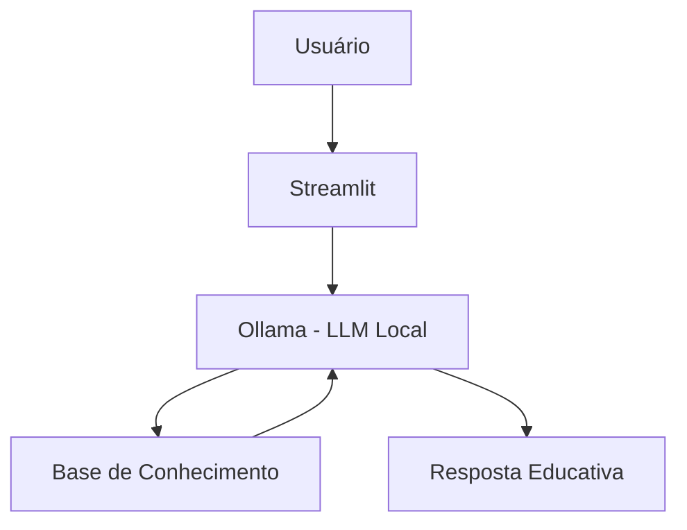

# 🎓 FinGuard - Guarda Financeiro Inteligente

> Agente de IA generativa que analisa dados de transações e o perfil do cliente para organizar gastos em categorias claras, gerar insights objetivos e apoiar o controle financeiro, sem realizar recomendações diretas de investimentos.

## 💡 O Que é o FinGuard?

O FinGuard é um guarda financeiro digital que atua de forma consultiva e educativa, transformando as transações do próprio cliente em informações claras e acionáveis.
Ele organiza os dados financeiros, identifica padrões de consumo e gera insights sempre alinhados às metas definidas pelo cliente, como controle de gastos, reserva de emergência ou a aquisição de um bem específico.

**O que o FinGuard faz:**
- ✅ Consolida as informações financeiras do cliente em uma visão clara e de fácil consulta
- ✅ Classifica e resume as transações em categorias objetivas e padronizadas
- ✅ Analisa os gastos considerando as metas financeiras declaradas pelo cliente
- ✅ Utiliza o histórico do próprio cliente como base para exemplos, comparações e acompanhamento de evolução
- ✅ Gera insights sobre como os hábitos de consumo impactam o progresso em relação às metas
- ✅ Apoia o planejamento financeiro por meio de simulações e estratégias simples, sempre alinhadas aos objetivos definidos

**O que o FinGuard NÃO faz:**
- ❌ Não recomenda investimentos específicos
- ❌ Não acessa dados bancários sensíveis
- ❌ Não substitui um profissional certificado

## 🏗️ Arquitetura



**Stack:**
- Interface: Streamlit
- LLM: Ollama (modelo local `qwen2.5:3b`)
- Dados: JSON/CSV mockados

## 📁 Estrutura do Projeto

```
├── data/                          # Base de conhecimento
│   ├── perfil_investidor.json     # Perfil do cliente
│   ├── transacoes.csv             # Histórico financeiro
│
├── docs/                          # Documentação completa
│   ├── 01-documentacao-agente.md  # Caso de uso e persona
│   ├── 02-base-conhecimento.md    # Estratégia de dados
│   ├── 03-prompts.md              # System prompt e exemplos
│   ├── 04-metricas.md             # Avaliação de qualidade
│   └── 05-pitch.md                # Apresentação do projeto
│
└── src/
    └── app.py                     # Aplicação Streamlit
```

## 🚀 Como Executar

### 1. Instalar Ollama

```bash
# Baixar em: ollama.com
ollama pull qwen2.5:3b
ollama serve
```

### 2. Instalar Dependências

```bash
pip install streamlit pandas requests
```

### 3. Rodar o FinGuard

```bash
streamlit run src/app.py
```

## 🎯 Exemplo de Uso

**Pergunta:** "Quanto ainda posso gastar no mês de dezembro?"  
**FinGuard:** "CDI é uma taxa de referência usada pelos bancos. Quando um investimento rende '100% do CDI', significa que ele acompanha essa taxa. Hoje o CDI está próximo da Selic. Quer que eu explique a diferença entre os dois?"

**Pergunta:** "Onde estou gastando mais?"  
**FinGuard:** "Olhando suas transações de outubro, sua maior despesa é moradia (R$ 1.380), seguida de alimentação (R$ 570). Juntas, representam quase 80% dos seus gastos. Isso é bem comum! Quer que eu explique algumas estratégias de organização?"

## 📊 Métricas de Avaliação

| Métrica | Objetivo |
|---------|----------|
| **Assertividade** | O agente responde o que foi perguntado? |
| **Segurança** | Evita inventar informações (anti-alucinação)? |
| **Coerência** | A resposta é adequada ao perfil do cliente? |

## 🎬 Diferenciais

- **Personalização:** Usa os dados do próprio cliente nos exemplos
- **100% Local:** Roda com Ollama, sem enviar dados para APIs externas
- **Educativo:** Foco em ensinar, não em vender produtos
- **Seguro:** Estratégias de anti-alucinação documentadas

## 📝 Documentação Completa

Toda a documentação técnica, estratégias de prompt e casos de teste estão disponíveis na pasta [`docs/`](./docs/).
