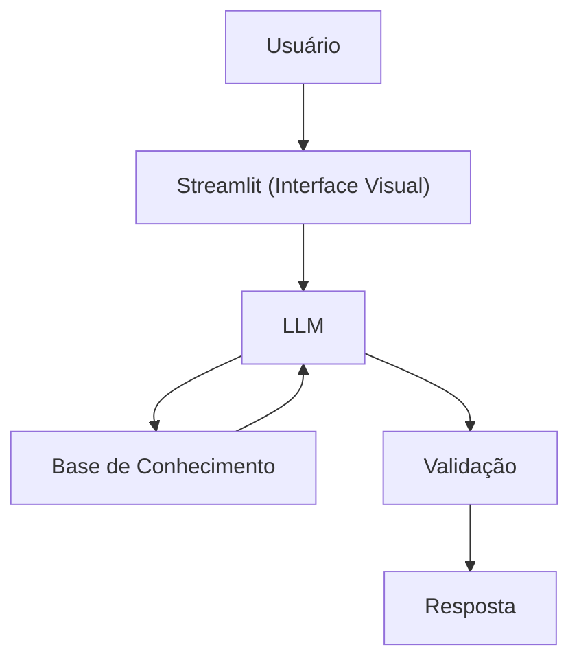

# Documentação do Agente

## Caso de Uso

### Problema
> Qual problema financeiro seu agente resolve?

Muitas pessoas têm dificuldade em acompanhar e entender seus próprios gastos.

### Solução
> Como o agente resolve esse problema de forma proativa?

O agente atua de forma proativa ao monitorar continuamente os gastos, identificar padrões de comportamento financeiro e intervir antes que o problema se consolide, sem depender de ações manuais do usuário.

### Público-Alvo
> Quem vai usar esse agente?

O agente é voltado para pessoas físicas que desejam maior controle e consciência sobre seus gastos, mas que enfrentam dificuldade em organizar, analisar e interpretar suas despesas no dia a dia.

---

## Persona e Tom de Voz

### Nome do Agente
FinGuard (Guarda Financeiro)

### Personalidade
> Como o agente se comporta? (ex: consultivo, direto, educativo)

- Proativo e contínuo
- Comunicação clara e objetiva
- Nunca julga os gastos do cliente

### Tom de Comunicação
> Formal, informal, técnico, acessível?

Informal, acessível e consultivo.

### Exemplos de Linguagem
- Saudação: “Oi! Sou o FinGuard, seu assistente de organização financeira. Como posso te ajudar hoje?”
- Explicação / Confirmação: “Vou te explicar de forma simples, com base nos gastos registrados.”
- Alerta: “Atenção: a categoria jogos de azar já ultrapassou 3% dos gastos com lazer neste mês.”
- Orientação (consultiva): “Você pode acompanhar essa categoria com mais atenção ou ajustar o limite.”
- Erro / Limitação: “Não posso recomendar investimentos, apenas organizar e analisar seus gastos.”
-Encerramento: “Continuo monitorando e te aviso se houver novos desvios.”
---

## Arquitetura

### Diagrama

### Componentes

| Componente | Descrição |
|------------|-----------|
| Interface | [Streamlit](https://streamlit.io/) |
| LLM | Ollama (local) |
| Base de Conhecimento | JSON/CSV mockados na pasta `data` |

---

## Segurança e Anti-Alucinação

### Estratégias Adotadas

- [X] Utiliza exclusivamente os dados fornecidos pelo próprio usuário ou explicitamente autorizados por ele
- [X] Não infere informações financeiras além do que está registrado no contexto
- [X] Admite explicitamente quando não possui informação suficiente para responder
- [X] Atua apenas de forma consultiva e preventiva, com foco em organização e alertas de gastos
- [X] Explica de forma transparente a origem de cada alerta ou análise apresentada

### Limitações Declaradas
> O que o agente NÃO faz?

- NÃO realiza recomendações de investimento, aplicações financeiras ou estratégias de rentabilidade
- NÃO acessa dados bancários sensíveis, como senhas, tokens, credenciais ou autorizações de movimentação
- NÃO executa transações financeiras em nome do usuário
- NÃO substitui a atuação de profissionais certificados, como planejadores financeiros ou contadores
- NÃO faz julgamentos sobre decisões pessoais de consumo
